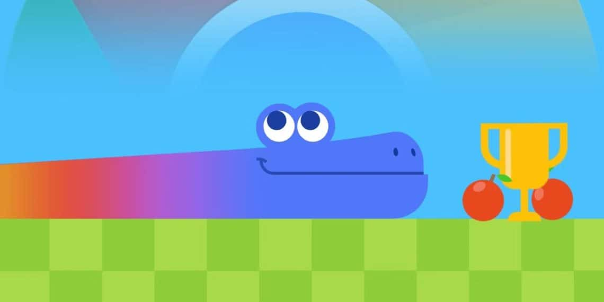

# Snake Game 🐍🎮 (Design inspired by the famous game Snake using C & C++!)

A **classic Snake game** built in **C++** for the terminal! Control your snake, eat food, avoid walls and yourself, and try to achieve the highest score! 🏆 This project uses file handling!

<div style="text-align:center;">
  
</div>


## 🎮 Features

- 🖥️ Terminal-based gameplay with simple, colorful graphics
- 🎯 Real-time input handling (no need to press Enter every time)
- ⬆️⬇️⬅️➡️ Directional movement:
  - `w` → Up
  - `s` → Down
  - `a` → Left
  - `d` → Right
- 🎨 Color-highlighted menu for intuitive navigation
- 🍎 Dynamic score display
- 💥 Collision detection with walls and self
- 🐍 Snake grows after eating food

---

## 📁 File Structure

- `main.cpp` 📝 Entry point, menu handling, and game loop  
- `input.cpp` ⌨️ Keyboard input handling  
- `input.h` 📄 Input definitions and Direction struct  
- `menu.cpp` 📜 Menu logic and navigation  
- `menu.h` 📄 Menu class declaration  
- `snake.cpp` 🐍 Snake movement, growth, and collision logic  
- `snake.h` 📄 Snake class declaration  
- `snake_map.cpp` 🗺️ Map rendering, food placement, and score display  
- `snake_map.h` 📄 Map constants and declarations  
- `macros.h` ⚙️ Game constants and macros

---

## 🕹️ How to Play

- Run the game:
```
./snake_game
```

- Use the menu to:

▶️ Start Game
❌ Exit 
  - `w` → Up
  - `s` → Down
  - `a` → Left
  - `d` → Right

- Eat the food (*) to grow! 🍎
- Avoid walls and yourself — or it's Game Over 💀

---

## 🧩 Game Logic Overview

### Snake Class 🐍:
Handles the snake’s body, movement, growth, and collision detection.

### SnakeMap Class 🗺️:
Manages map rendering, food placement, and score display.

### Menu Class 📜:
Provides menu navigation using multithreading for responsive input.

### Input Handling ⌨️:
Uses termios to capture single-character input without requiring Enter.
